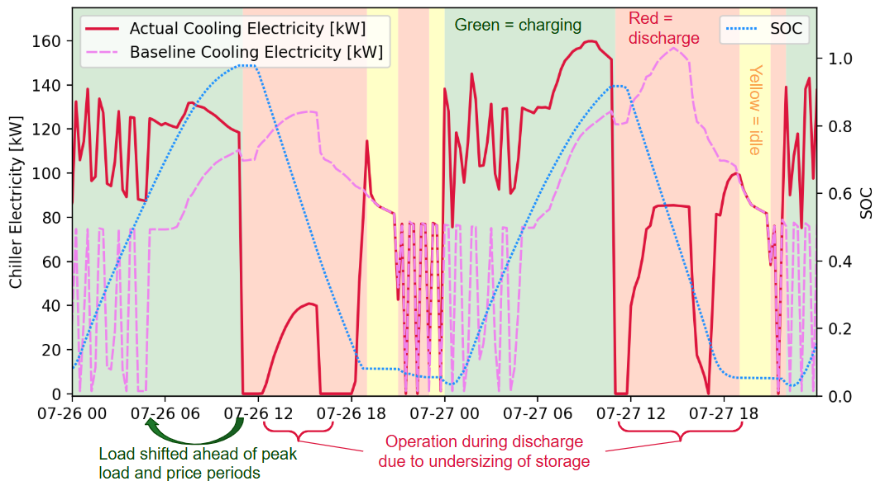
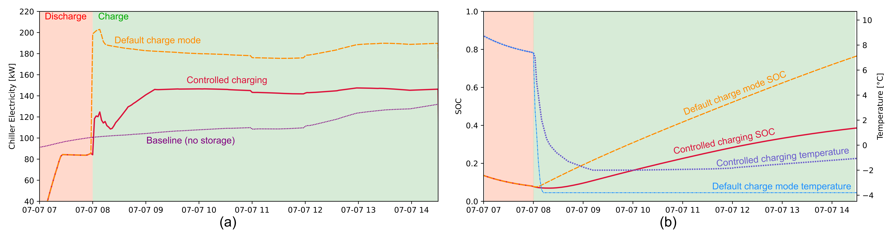

# Dynamic Charge Controls Reference

The Dynamic Charge Controls purpose is to determine an optimal charging schedule to minimize cooling electricity costs under TOU rates that may include energy and/or demand charge components. Schedules vary each day, depending on baseline load, rate, and the expected COP under different conditions. The dynamic charge control logic calculates incremental cost (including demand charges) of operating each hour, then iteratively shifts operation from the most expensive times to earlier lower-cost times while satisfying load & equipment constraints. 

These controls address the challenges of:
- Optimize to reduce cost under varying TOU rates, while accounting for changes in weather and thermal load on each day.
- Charging can create new demand charges by leading to spikes in demand, which can lead to increase costs for electric tariffs with high demand charges. Adjusting both TES operating mode and charging temperature can modulate these.
- Account for changes in COP between charge, idle, and discharge modes; and with variation in outdoor air temperature. 
- The control logic is simpler than that of Model Predictive Control (MPC) in that it does not require a detailed model of the building to perform optimization.

Dynamic Charge Controls are currently implemented and tested for icetank TES. 

## Usage:

```bash
stor4build  run-icetank-dynamic OSM EPW [OPTIONS]
```

### Options

__`--openstudio`__ `<openstudio>`  
	OpenStudio CLI to use.  
		__Default__  
			`'openstudio'`  

__`--r`__, __`--run-dir`__ `<run_dir>`  
	Directory to run in.  
		__Default__  
			`'.'`

__`--m`__, __`--measures-dir`__ `<measures_dir>`  
	Directory containing measures.  
		__Default__  
			`'.'`

__`--n`__, __`--ntanks`__ `<N>`  
	Number of tanks.  
		__Default__  
			`1`

<!-- NOTE: Many of the other options for the regular `run-icetank` will probably still work. Those can be copy-pasted here. -->   

### Arguments

__OSM__
	Required argument. Path to `.osm` file.

__EPW__
	Required argument. Path to `.epw` file.


## Dynamic Charge Control Algorithm


Example of the dynamic charge controls over a 2 day period. Load is shifted ahead of peak load periods that would cause an increase in demand charges, as well as avoiding peak price periods. The schedule is different each day.

The core principle of the dynamic charge control algorithm is to iteratively calculate the incremental cost of operation in each timestep, detect the highest cost timestep (accounting for time-varying demand charges and volumetric charges), then shift the load to an earlier lower-cost time if possible. Typically, the entire load in that hour is shifted in order to avoid less-efficient operation at part-load. If there is no earlier hour that meets all constraints and will lead to lower cost, the timestep is flagged as unavoidable. The iteration continues until all hours with an incremental cost greater than average have been shifted or marked unavoidable.

### Inputs

Key inputs are the thermal load from a baseline (no-TES) run, equipment performance curves, and weather data (outdoor air temperature).

### Constraints

Key constraints are:
- TES capacity
- TES maximum charge and discharge rates
- maximum chiller capacity
- building thermal load must always be met

### Consideration of COP

COP is obtained using the chiller curves defined in the `.idf` or `.osm` file. Two performance curves are accounted for:
1. "EIRFT" Curve:Biquadratic for chiller performance relative to outdoor air temperature (OAT).
2. "fQRatio" Curve:Quadratic for chiller performance based on part load ratio (PLR).

The calculations also require finding the `cop_ref`, `min_plr` and `min_ur` for the Chiller:Electric:EIR.

The control algorithm calculates the expected COP at each hour under each TES operation mode, based on the PLR and OAT. Load can be calculated using the baseline load + charging load, assuming a certain charge rate. 

Using the COP, it then calculates the electricity (kWh) required to add an incremental amount of cooling (kWh-thermal). 

### Temperature Control

When starting to charge TES, there is a sudden increase in thermal load if the set temperature immediately drops to the target charging temperature. As a result, the electrical load can jump significantly for a 5-15 minute period. Under demand charges, this often leads to an increased overall peak demand compared to the baseline (no-TES) case, and may yield negative savings.

To prevent this, the dynamic charge controls use a temperature ramping method. For simplicity, there is a constant curve for the rate of temperature decrease.

With the gradual decrease in temperature, the TES will briefly discharge when charging begins, if the chiller temperature is above the melting point for the TES. Across several models, approximately the first 1 hour of charging then has little to no increase of SOC but causes an increase in electricity consumption during that hour. To avoid this, the algorithm accounts for the decreased cost when charging in adjacent hours. A final check will detect charging periods of 1 hour or less and removes them.

Additionally, maintaining a constant charging temperature when the baseline load is at its peak can lead to increased peak demand compared to if there were no TES. In testing, this often occurred in the early afternoon at under rates where the electricity price is low during the early afternoon. The algorithm detects when the baseline load is near the maximum and reduces the charge temperature proportionately during those times.


Demonstration of the effect of charging temperature. (a) Comparison of chiller electricity consumption between storage with the default charge mode, manually-controlled charging temperature, and a baseline case without storage. (b) Comparison of the state of charge (SOC) and set charging temperature for the two charging methods.

### Outputs

The dynamic charge control algorithm produces an interval schedule with the mode for each timestep and the charging temperature during all charging periods.

## Simulation Workflow

This section describes the major steps performed by the `run-icetank-dynamic` command: 
1. Run model in OpenStudio with the icetanks in idle the entire time to create a baseline with the same parameters we can read when scheduling the controls. This uses the `add_pytank_with_schedule` measure, adapted from `add_pytank`. This charge schedule is a constant in `stor4build/resources/baseline_schedule_15min.csv`. The outputs of this simulation will go into a "no_icetank" folder within the output directory specified with the `-r` parameter.
2. Using the output files of step 1, run `generate_schedule()` in `stor4build/src/stor4build/dynamic_charge_controls.py`. This will run the scheduling script, which will produce a file called `dynamic_charge_schedule.csv` with TES mode and charging temperature. The process is described in the [Dynamic Charge Control Algorithm](#dynamic-charge-control-algorithm) section.
3. Run the model in OpenStudio again with the `add_pytank_with_schedule` measure, this time with the optimized charging mode schedule. The result will be in the `run` subdirectory of the output directory specified with the `-r` parameter.


## Limitations

__Currently, only Icetank TES is supported__: In _theory_, these controls should work for any TES. However, this would require significant modification of the input parameters and constraints to handle each case. Analysis would be required to validate the controls work as intended for these new cases.

__Timestep must be 15 minutes__: Currently, the code only works with a timestep of 15 minutes (or 4 timesteps per hour). This is enforced in the `add_pytank_with_schedule` measure. _This is planned to be fixed in a future release_

__COP calculations assume all chillers are identical__: The function to [automatically detect the COP](#consideration-of-cop) uses a string search in the original simulation file. 

__Electricity consumption and COP calculations used in the optimization are imperfect__: The rate of thermal energy transfer to the TES (which is a key factor in electricity consumption and COP) when charging or discharging depend on the current state of charge of the TES. The algorithm uses a simple mathematical assumption that the net change in charge is the sum of the thermal energy removed by the chiller, added when discharging, and added through standby losses. This model is imperfect, which occasionally causes electricity consumption and COP to be different than what was forecasted. Crucially, if SOC is lower than expected, the actual electricity consumption may spike higher than expected, leading to increased costs under electricity rates with demand charges if this happens even once in a billing period. If the algorithm had a perfect model for SOC or were running closed-loop, these spikes in demand could be avoided. As a partial solution, the current algorithm makes conservative assumptions to reduce the risk of demand spikes, however these limit the charge rate during lower cost times (increasing costs) and are typically only sufficient to avoid significantly increasing the demand charges with the dynamic charge controls compared to the no-TES baseline (in theory, the demand charges could be reduced).

## Extending Controls

The dynamic charge controls functions in `src/stor4build/dynamic_charge_controls.py` can be modified in a local installation by advanced users. Potential use cases are to make small modifications to the control logic to better handle a different rate structure or building type, or using the existing processing code to communicate as a framework to test other controls strategies.

Recompiling is necessary to reflect any modifications to the the Python scripts when running `stor4build` commands. Run the following after modifications are complete, but before running any `stor4build` command.

```bash
pip uninstall stor4build -y && pip install . 
```

Note this is not required for changes to Ruby scripts.
